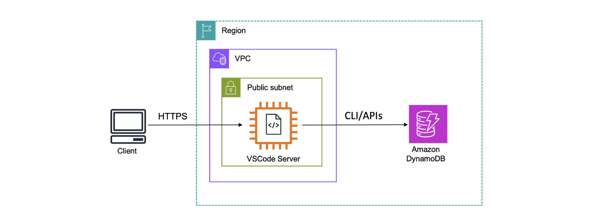

# Amazon DynamoDB Data Modeling & Access Patterns Workshop

## 📖 Project Overview
This project demonstrates hands-on experience with **Amazon DynamoDB**, focusing on **data modeling, access patterns, query optimization, and scalability best practices**.

The use case simulates a **forum-style application**, where multiple DynamoDB tables are designed to support different access patterns efficiently. The project highlights how design decisions impact **performance, cost, and query efficiency** in NoSQL systems.

---

## 🎯 What I Practiced in This Project
- Designing DynamoDB tables based on access patterns
- Using **GetItem, Query, and Scan** operations
- Understanding **Scan vs Query performance and cost**
- Handling **reserved keywords** in DynamoDB expressions
- Creating and querying **Global Secondary Indexes (GSIs)**
- Comparing **RCU consumption** across access patterns
- Managing data via **AWS CLI and AWS Console**
- Enabling **Point-in-Time Recovery (PITR)** for data protection

---

## 🏗️ Architecture Overview
The application models a forum system using multiple DynamoDB tables.

---

## 🧩 DynamoDB Tables

| Table Name | Partition Key | Sort Key |
|-----------|---------------|----------|
| Forum | Name (S) | — |
| Thread | ForumName (S) | Subject (S) |
| Reply | Id (S) | ReplyDateTime (S) |

---

## 🔍 Access Patterns & Queries

### 1️⃣ Scan with Filter Expressions
Scan operations were used to retrieve data based on non-key attributes.  
This demonstrated how **Scan reads the entire table** and consumes more RCUs.

---

### 2️⃣ Reserved Keyword Handling
While filtering data, a **reserved keyword error** was encountered (`Views`).  
This was resolved using `ExpressionAttributeNames`.

❌ Reserved keyword error:

✅ Fixed using `ExpressionAttributeNames`:

---

### 3️⃣ Query vs Scan Comparison
Query operations were compared with Scan operations to observe:
- Items returned vs items scanned
- RCU consumption
- Query efficiency

---

## 🚀 Global Secondary Index (GSI)

### Why a GSI?
The original table design did not support querying replies by user efficiently.  
A **Global Secondary Index (GSI)** was introduced to enable this access pattern without redesigning the table.

### GSI Configuration
- **Index Name:** `PostedBy-ReplyDateTime-gsi`
- **Partition Key:** PostedBy
- **Sort Key:** ReplyDateTime
- **Projection Type:** ALL

---

### Querying Data Using GSI
Once the GSI became active, queries were executed efficiently using the new access pattern.

---

## 🔐 Data Protection & Recovery

### Point-in-Time Recovery (PITR)
To protect against accidental deletes or overwrites:
- **Point-in-Time Recovery (PITR)** was enabled
- Recovery window set to **35 days**

---

## 🧠 Key Learnings
- DynamoDB performance depends heavily on **data model design**
- **Scan operations are expensive** and should be avoided at scale
- GSIs enable new access patterns without re-architecting tables
- Monitoring **RCU usage** is critical for cost control
- DynamoDB design starts with **access patterns**, not schema

---

## 🛠️ Tools & Technologies
- Amazon DynamoDB  
- AWS CLI  
- AWS Management Console  
- NoSQL Data Modeling  

---

## ✅ Project Status
✔ Completed  
✔ Tested using CLI and Console  
✔ Portfolio-ready
